## Goal 
This data contains the location and circumstances of every field goal attempted by Kobe Bryant took during his 20-year career. The goal is to predict whether the basket went in (shot_made_flag).

## Data
https://www.kaggle.com/c/kobe-bryant-shot-selection/data?data.csv.zip

## Variable information
 
```
str(datawithshots)
'data.frame':	25697 obs. of  25 variables:
 $ action_type       : Factor w/ 57 levels "Alley Oop Dunk Shot",..: 27 27 27 6 27 28 27 42 27 27 ...
 $ combined_shot_type: Factor w/ 6 levels "Bank Shot","Dunk",..: 4 4 4 2 4 5 4 4 4 4 ...
 $ game_event_id     : int  12 35 43 155 244 251 265 294 309 4 ...
 $ game_id           : int  20000012 20000012 20000012 20000012 20000012 20000012 20000012 20000012 20000012 20000019 ...
 $ lat               : num  34 33.9 33.9 34 34.1 ...
 $ loc_x             : int  -157 -101 138 0 -145 0 -65 -33 -94 121 ...
 $ loc_y             : int  0 135 175 0 -11 0 108 125 238 127 ...
 $ lon               : num  -118 -118 -118 -118 -118 ...
 $ minutes_remaining : int  10 7 6 6 9 8 6 3 1 11 ...
 $ period            : int  1 1 1 2 3 3 3 3 3 1 ...
 $ playoffs          : int  0 0 0 0 0 0 0 0 0 0 ...
 $ season            : Factor w/ 20 levels "1996-97","1997-98",..: 5 5 5 5 5 5 5 5 5 5 ...
 $ seconds_remaining : int  22 45 52 19 32 52 12 36 56 0 ...
 $ shot_distance     : int  15 16 22 0 14 0 12 12 25 17 ...
 $ shot_made_flag    : int  0 1 0 1 0 1 1 0 0 1 ...
 $ shot_type         : Factor w/ 2 levels "2PT Field Goal",..: 1 1 1 1 1 1 1 1 2 1 ...
 $ shot_zone_area    : Factor w/ 6 levels "Back Court(BC)",..: 4 3 5 2 4 2 4 2 3 5 ...
 $ shot_zone_basic   : Factor w/ 7 levels "Above the Break 3",..: 5 5 5 6 5 6 3 3 1 5 ...
 $ shot_zone_range   : Factor w/ 5 levels "16-24 ft.","24+ ft.",..: 3 1 1 5 3 5 3 3 2 1 ...
 $ team_id           : int  1610612747 1610612747 1610612747 1610612747 1610612747 1610612747 1610612747 1610612747 1610612747 1610612747 ...
 $ team_name         : Factor w/ 1 level "Los Angeles Lakers": 1 1 1 1 1 1 1 1 1 1 ...
 $ game_date         : Factor w/ 1559 levels "1996-11-03","1996-11-05",..: 311 311 311 311 311 311 311 311 311 312 ...
 $ matchup           : Factor w/ 74 levels "LAL @ ATL","LAL @ BKN",..: 29 29 29 29 29 29 29 29 29 72 ...
 $ opponent          : Factor w/ 33 levels "ATL","BKN","BOS",..: 26 26 26 26 26 26 26 26 26 31 ...
 $ shot_id           : int  2 3 4 5 6 7 9 10 11 12 ...
```

### Correlations 
* shot_distance = (loc_x$^2$ + loc_y$^2$)$^{1/2}$
* lat and lon are the "same" as loc_x and loc_y
* game_id has a correlation with playoffs and game_date

### Variables to take
* action_type
```
 27                         Jump Shot
  6                 Driving Dunk Shot
 28                        Layup Shot
 42                 Running Jump Shot
 34                 Reverse Dunk Shot
 48                    Slam Dunk Shot
 13                Driving Layup Shot
 57              Turnaround Jump Shot
 35                Reverse Layup Shot
 51                          Tip Shot
 41                 Running Hook Shot
  1               Alley Oop Dunk Shot
 16                         Dunk Shot
  2              Alley Oop Layup shot
 38                 Running Dunk Shot
  8          Driving Finger Roll Shot
 43                Running Layup Shot
 20                  Finger Roll Shot
 18                Fadeaway Jump Shot
 22               Follow Up Dunk Shot
 24                         Hook Shot
 56              Turnaround Hook Shot
 26                    Jump Hook Shot
 40          Running Finger Roll Shot
 25                    Jump Bank Shot
 55       Turnaround Finger Roll Shot
 23                    Hook Bank Shot
 11                 Driving Hook Shot
 47                  Running Tip Shot
 45        Running Reverse Layup Shot
  7    Driving Finger Roll Layup Shot
 17                Fadeaway Bank shot
 30                  Pullup Jump shot
 19            Finger Roll Layup Shot
 54          Turnaround Fadeaway shot
 14        Driving Reverse Layup Shot
 15            Driving Slam Dunk Shot
 49               Step Back Jump shot
 52              Turnaround Bank shot
 36            Reverse Slam Dunk Shot
 21                Floating Jump shot
 33            Putback Slam Dunk Shot
 37                 Running Bank shot
  5                 Driving Bank shot
 12                 Driving Jump shot
 32                Putback Layup Shot
 31                 Putback Dunk Shot
 39    Running Finger Roll Layup Shot
 29                  Pullup Bank shot
 46            Running Slam Dunk Shot
  4                Cutting Layup Shot
 10        Driving Floating Jump Shot
 44         Running Pull-Up Jump Shot
 50                    Tip Layup Shot
  9   Driving Floating Bank Jump Shot
```
* game_date or days since start
* time left in game 
```
timeleftingame <- (4-ifelse(datawithshots$period>4, 4, datawithshots$period))*15 + datawithshots$minutes_remaining + as.integer(datawithshots$seconds_remaining/60)
```
* Court position loc_x and loc_y
* Matchup

## Analysis
Displaying shot made percentage as a function of different parameters: 

```
madeshots<-c()
takenshot<-c()

# Decide what parameter to use
param<-"action_type"
# param<-"game_date"

for(x in unique(datawithshots[[param]])){
    madeshots<-c(madeshots,sum(datawithshots$shot_made_flag[datawithshots[[param]]==x]))
    takenshot<-c(takenshot,sum(!is.na(datawithshots$shot_made_flag[datawithshots[[param]]==x])))
}
percentmade<-madeshots*100/takenshot

# Defining new parameter dayssincestart
gamedate <- as.vector(unique(datawithshots$game_date))
gamedate <- sort(as.Date.character(gamedate))
dayssincestart <- as.numeric(gamedate - gamedate[1])

# Defining new parameter timeleftingame
timeleftingame <- ((4-datawithshots$period)*15 + datawithshots$minutes_remaining)*60 + datawithshots$seconds_remaining

# Decide what to use on x-axis in the next plot
x_axis <- as.numeric(unique(datawithshots$action_type))
# x_axis <- dayssincestart
# x_axis <-timeleftingame

library(ggpmisc)
# Plot of percentage shots done versus dayssincestart 
permade <- data.frame(xaxis = x_axis, percenmade = as.vector(percentmade))
permade <- permade[order(permade$xaxis),]
my.formula <- y ~ x

ggplot(permade, aes(x=xaxis, y=percenmade)) + 
  geom_point(shape = 1, col="blue") +
  xlab("Days since start") +
  ylab("shot made percentage") +
  geom_smooth(method=lm, formula = my.formula) +
  stat_poly_eq(formula = my.formula,
               eq.with.lhs = "italic(h)~`=`~",
               eq.x.rhs = "~italic(z)",
               aes(label = ..eq.label..), 
               parse = TRUE)  #  (by default includes 95% confidence region)
```

* Not a strong dependance of percentage completion as a function of days since KB started playing:
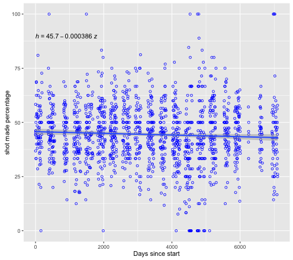
* A strong dependance of percentage completion as a function of type of shot:
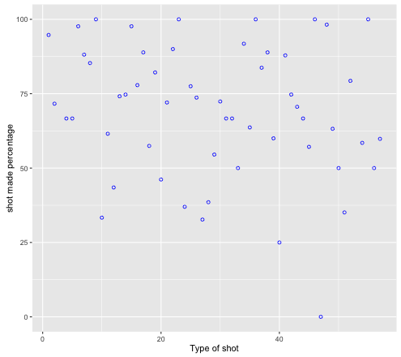
* KB is not a clutch player: 
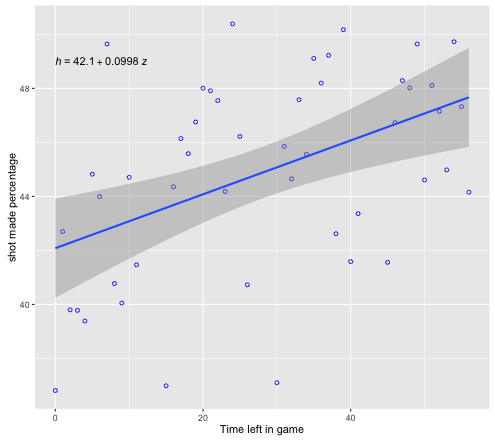
* Positioning in the court matters:
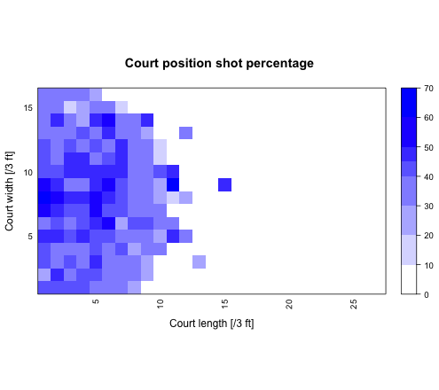
* Games in playoffs do not matter since shot completion percentage changes from 44.64% to 44.46% between playoff and non-playoff games
* Matchup matters for KB:
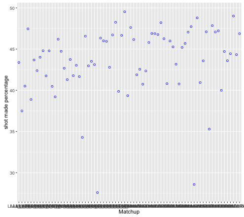

* GLM predictions as a function of action_type:
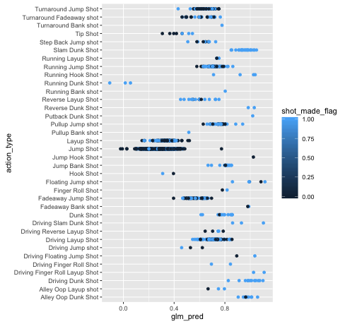

* We noticed that our results show a dichotomy in the log-loss. We may need to do two models for the bad predictions. On top of that we noticed that as time into game increases there is a worsening of the bad predictions. We may need to add a variable referring to overtime. Following figures are gated in action_type = "Jump Shot":
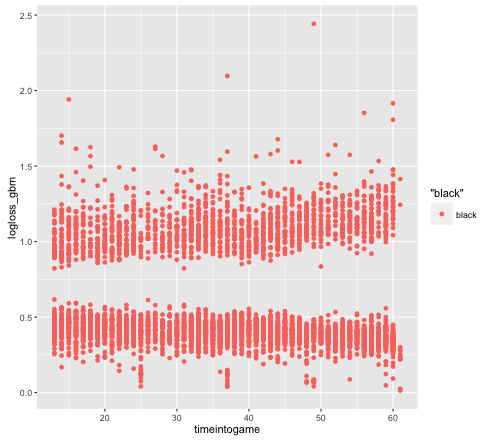

* There is also a worsening of bad predictions for the last few seasons:
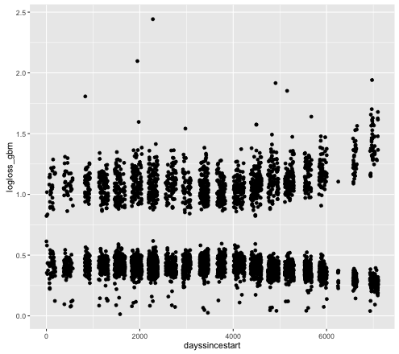

* X and Y position:
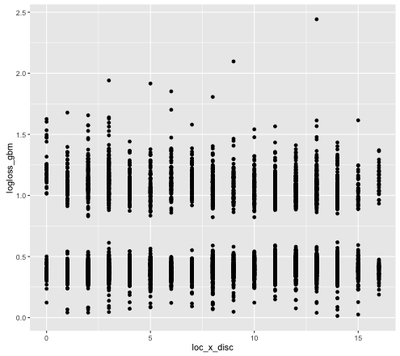
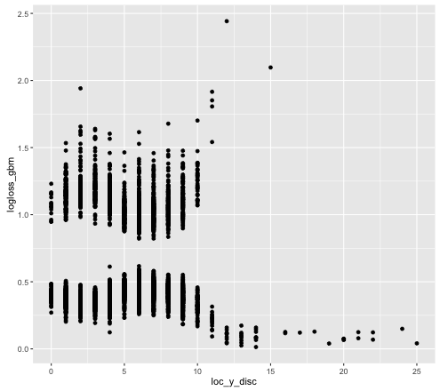

* The dichotomy is due to the fact that for some types of action_type (i.e. "Jump Shot") all the predictions are below 0.5.  Even when training the data only with that specific action_type, the predictions are all below 0.5:
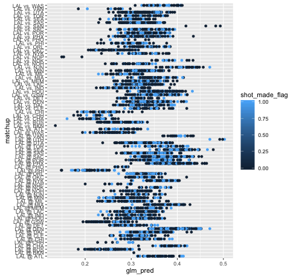
The problem is that the shots made and shots not made are all over the place. It does not seem like a good model at all, however the log-loss value is 0.634!. "Displacing" the glm prediction in either direction only increased the log-loss value. When trying a tree prediction, the result "looks better" but the log-loss is 0.788.

* Adding more variables (playoffs + shot_type + shot_zone_area) for training, do not eliminate (nor reduce) the problem. 

* Using a log-loss metric did not improve the problem significantly. The total log-loss value is still >0.60.

## Things to try:

- Forest tree:  Use features home/away and opponents as replacement of the matchup feature. Dump action_type categories with a small number of shots into one category

- Train on basic_shot_type

- Train different models and take optimal results as a function of subsets