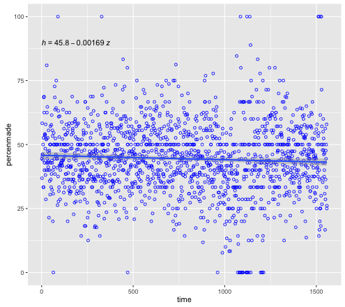

## Goal 
This data contains the location and circumstances of every field goal attempted by Kobe Bryant took during his 20-year career. Your task is to predict whether the basket went in (shot_made_flag).

## Data
https://www.kaggle.com/c/kobe-bryant-shot-selection/data?data.csv.zip

## Variable information
 
```
str(datawithshots)
'data.frame':	25697 obs. of  25 variables:
 $ action_type       : Factor w/ 57 levels "Alley Oop Dunk Shot",..: 27 27 27 6 27 28 27 42 27 27 ...
 $ combined_shot_type: Factor w/ 6 levels "Bank Shot","Dunk",..: 4 4 4 2 4 5 4 4 4 4 ...
 $ game_event_id     : int  12 35 43 155 244 251 265 294 309 4 ...
 $ game_id           : int  20000012 20000012 20000012 20000012 20000012 20000012 20000012 20000012 20000012 20000019 ...
 $ lat               : num  34 33.9 33.9 34 34.1 ...
 $ loc_x             : int  -157 -101 138 0 -145 0 -65 -33 -94 121 ...
 $ loc_y             : int  0 135 175 0 -11 0 108 125 238 127 ...
 $ lon               : num  -118 -118 -118 -118 -118 ...
 $ minutes_remaining : int  10 7 6 6 9 8 6 3 1 11 ...
 $ period            : int  1 1 1 2 3 3 3 3 3 1 ...
 $ playoffs          : int  0 0 0 0 0 0 0 0 0 0 ...
 $ season            : Factor w/ 20 levels "1996-97","1997-98",..: 5 5 5 5 5 5 5 5 5 5 ...
 $ seconds_remaining : int  22 45 52 19 32 52 12 36 56 0 ...
 $ shot_distance     : int  15 16 22 0 14 0 12 12 25 17 ...
 $ shot_made_flag    : int  0 1 0 1 0 1 1 0 0 1 ...
 $ shot_type         : Factor w/ 2 levels "2PT Field Goal",..: 1 1 1 1 1 1 1 1 2 1 ...
 $ shot_zone_area    : Factor w/ 6 levels "Back Court(BC)",..: 4 3 5 2 4 2 4 2 3 5 ...
 $ shot_zone_basic   : Factor w/ 7 levels "Above the Break 3",..: 5 5 5 6 5 6 3 3 1 5 ...
 $ shot_zone_range   : Factor w/ 5 levels "16-24 ft.","24+ ft.",..: 3 1 1 5 3 5 3 3 2 1 ...
 $ team_id           : int  1610612747 1610612747 1610612747 1610612747 1610612747 1610612747 1610612747 1610612747 1610612747 1610612747 ...
 $ team_name         : Factor w/ 1 level "Los Angeles Lakers": 1 1 1 1 1 1 1 1 1 1 ...
 $ game_date         : Factor w/ 1559 levels "1996-11-03","1996-11-05",..: 311 311 311 311 311 311 311 311 311 312 ...
 $ matchup           : Factor w/ 74 levels "LAL @ ATL","LAL @ BKN",..: 29 29 29 29 29 29 29 29 29 72 ...
 $ opponent          : Factor w/ 33 levels "ATL","BKN","BOS",..: 26 26 26 26 26 26 26 26 26 31 ...
 $ shot_id           : int  2 3 4 5 6 7 9 10 11 12 ...
```

### Correlations 
* shot_distance = sqrt(loc_x^2 + loc_y^2)
* lat and lon are the "same" as loc_x and loc_y

### Variables to take
* action_type

## Analysis
Displaying shot made percentage as a function of game_id: 

```
library(ggpmisc)
permade <- data.frame(time = 1:length(as.vector(percentmade)), percenmade = as.vector(percentmade))
my.formula <- y ~ x
ggplot(permade, aes(x=time, y=percenmade)) + 
  geom_point(shape = 1, col="blue") +
  geom_smooth(method=lm, formula = my.formula) +
  stat_poly_eq(formula = my.formula,
               eq.with.lhs = "italic(h)~`=`~",
               eq.x.rhs = "~italic(z)",
               aes(label = ..eq.label..), 
               parse = TRUE) 
#  (by default includes 95% confidence region)
```


So, not a strong dependance of percentage completion as a function of game_id ~ time!

